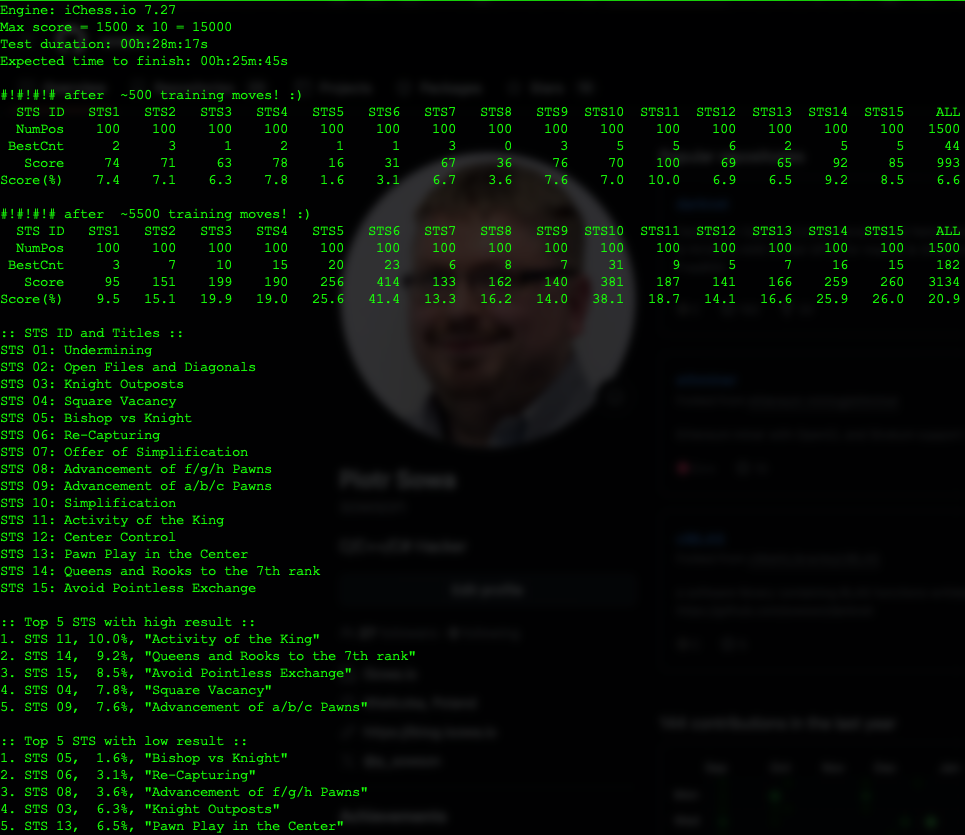
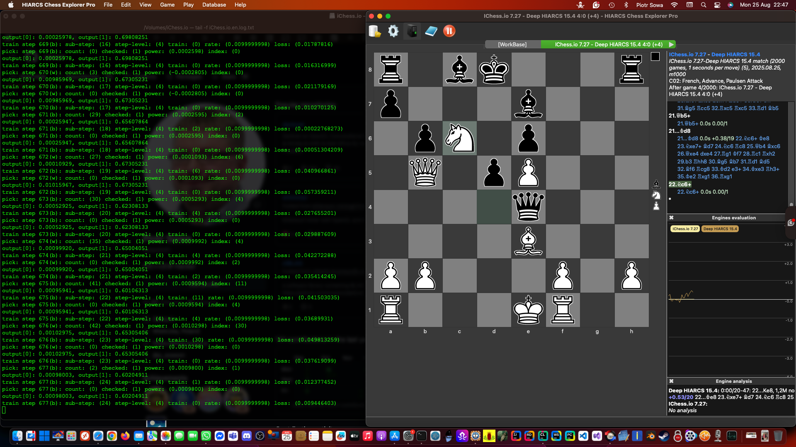
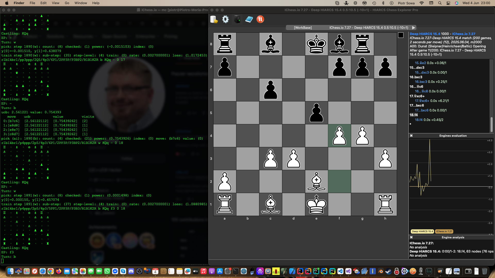

# Darknet v1.1.1 — AI CNN Computer Vision Engine

📄 This work is described in the scientific paper: https://doi.org/10.1002/cpe.6936

## Darknet v1.1.1 new Feature - the iChess.io v7.27 and Master Class Training Results



## Darknet v1.1.1 new Feature - the iChess.io v7.27 and Master Class Training



on macOS install: ```brew install stockfish``` and enjoy! :D

## Darknet v1.1 — new Feature - the iChess.io v7.27



## 🚀 Overview of new example in Darknet v1.1

**iChess.io v7.27** is a high-performance **Convolutional Neural Network (CNN)** based Chess & Chess960 engine for play at https://iChess.io, built on top of the Darknet framework. This versatile engine supports multiple AI/ML use cases, such as:

- Chess & Chess960 UCI Engine (AI gameplay)
- Object detection (YOLOv1–v4 on OpenCL)
- Multi-GPU inference and training
- Embedded system deployment (e.g., BeagleBoard AI)

It is fully portable, GPU-accelerated, and compatible with **OpenCL**, and **CPU**.

## 💡 Example Use Cases

- ✅ **Chess AI (UCI) Integration** — play chess with AI trained via CNNs
- 🎯 **YOLOv2 OpenCL** — real-time object detection on multi-GPU setups
- 🔬 **Research & Education** — train and evaluate CNN models in RAMDisk environments
- 🧠 **Computer Vision on Embedded Devices** — accelerated inference on edge hardware

## 🧰 Build Instructions (macOS / Ubuntu 20.04)

```bash
# Clone and prepare
mkdir iChess.io.en && cd iChess.io.en
git clone --recursive https://github.com/sowson/darknet

# Build libchess (used in the chess example)
cd darknet/cmake/libchess && mkdir build && cd build
cmake .. && make -j
cp shared/libchess.* ../../../3rdparty/libchess/

# Build engine with chess example enabled
cd ../../../.. && mkdir darknet/build && cd darknet/build
cmake -DDARKNET_ENG_CHESS=1 .. && make -j

# Copy example config and weights
cp ../cfg/chess.cfg ../../ && cp ../weights/chess.weights ../../
```

## 🧪 Sample Execution (Chess UCI Mode)

```bash
./iChess.io.en
iChess.io by Piotr Sowa v7.27

position startpos moves e2e4 b8c6 d2d4
go

info depth 1 pv e7e5
bestmove e7e5 ponder e7e5
```

## ⚙️ Dependencies

- [nlohmann/json](https://github.com/nlohmann/json)
- [libchess](https://github.com/sowson/libchess) (used for chess demo)

## 📦 Platform Support

- ✅ macOS (Intel / Apple Silicon)
- ✅ Ubuntu Linux 20.04+
- ⚠️ Windows 10/11 (experimental OpenCL build)

### Windows Build Guide:
https://iblog.isowa.io/2021/11/20/darknet-on-opencl-on-windows-11-x64

## 🧠 Training & Optimization Tips

- Run from **RAMDisk** to reduce disk wear and speed up training/inference:
    - Linux: `sudo mount -t tmpfs -o size=4096M tmpfs /your/ramdisk`
    - macOS: `diskutil erasevolume HFS+ "ramdisk" $(hdiutil attach -nomount ram://8388608)`

- Replace clBLAS with **CLBlast** for improved GEMM performance:
```bash
git apply patches/clblast.patch
```

## 🔗 Related Projects

- [Darknet-vNext](https://github.com/sowson/darknet-vNext) — CUDA-enhanced variant
- [YOLO on OpenCL](https://iblog.isowa.io/2020/07/02/the-multi-gpu-set-idea)

## 📽️ Demos & Videos

- [4 x AMD Radeon RX 6900 XT Demo (macOS)](https://www.youtube.com/watch?v=W6VOLjgwKNI)
- [YOLO2 Multi-GPU Result](https://www.youtube.com/watch?v=o-PV3vmfP-0)
- [YOLO Training](https://www.youtube.com/watch?v=Mxw7XkFBFPc)

## 🙏 Acknowledgements

Created by **Piotr Sowa** — AI researcher, GPU software engineer, and creator of [iChess.io](https://iChess.io).
More information and tutorials at [iBlog.isowa.io](https://iblog.isowa.io).

---

For citations, academic usage, or collaboration inquiries, feel free to reach out via GitHub or LinkedIn.
